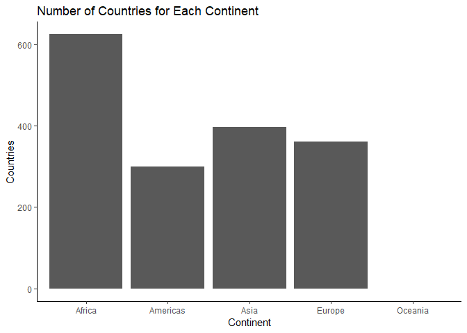
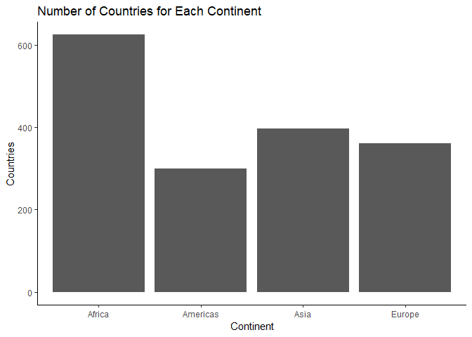
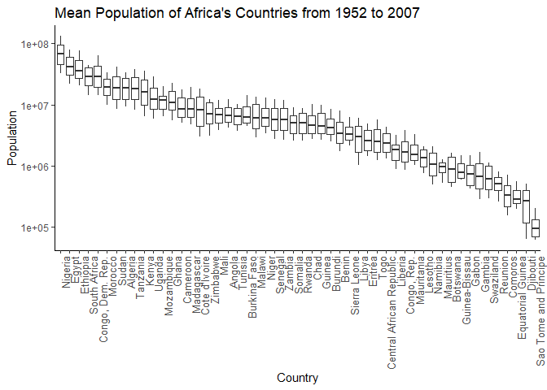
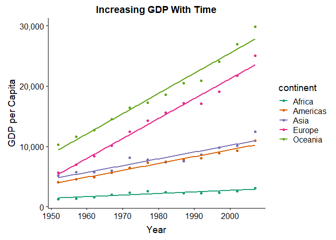

Homework 5: Factor and Figure Management
================
Jessica Schaub
October 10, 2018

-   [Introduction](#introduction)
-   [Load Packages](#load-packages)

### Introduction

For this assignment, we will refine our figure-making skills and learn to work with factors. We are given the option of working with `Gapminder` or `Singer` datasets, and I have chosen `Gapminder`. Please see the [assignment](http://stat545.com/Classroom/assignments/hw05/hw05.html) for more information.

### Load Packages

The required packages for this assignment are loaded here.

``` r
# tidyverse
suppressPackageStartupMessages(library(tidyverse))
# knitr
suppressPackageStartupMessages(library(knitr))
#gapminder
suppressPackageStartupMessages(library(gapminder))
#cowplot
suppressPackageStartupMessages(library(cowplot))
#plotly
suppressPackageStartupMessages(library(plotly))
#scales
suppressPackageStartupMessages(library(scales))
```

#### Part 1: Factor Management

The task here is to determine whether all variables are factors, then to (i) drop factors and (ii) Reorder levels based on knowledge from data.

It is helpful to define the following terms: - factor: Used to represent categorical data. They are stored as integers but look and behave like characters - level: A pre-defined set of values that a factor can contain. - Ex. "Male" & "Female" are two levels for the factor "Gender"

##### Characterize the Data Before Manipulation

Before performing our manipulations, we must determine what type of data we are using.

``` r
#Check gapminder variable types
sapply(gapminder, class) %>% 
  kable()
```

|           | x       |
|-----------|:--------|
| country   | factor  |
| continent | factor  |
| year      | integer |
| lifeExp   | numeric |
| pop       | integer |
| gdpPercap | numeric |

It seems only the "Continent" and "Country" variables are factors, so we will work with these variables in our manipulation.

##### Drop Oceania

The task is now to remove all observations of Oceania from the data frame, then remove unused factor levels.

``` r
# Remove Oceania
gap_no_oceania <- gapminder %>% 
  filter(continent != "Oceania") #filter for everything that's not (!=) Oceania
```

Now that we have removed Oceania, we can check number of rows to determine if it worked.

``` r
# How many observations of Oceania were present in the original data set
nrow(gapminder[gapminder$continent == "Oceania",])
```

    ## [1] 24

``` r
# Check data frame dimensions
nrow(gapminder)  #original
```

    ## [1] 1704

``` r
nrow(gap_no_oceania)   #removed Oceania
```

    ## [1] 1680

There were 24 observations of Oceania in the original Gapminder data set, and the new data set has lost 24 rows. Our removal worked!

Now we can check if we have unused levels.

``` r
#Bar plot to check if the levels of Oceania still exist
ggplot(gap_no_oceania, aes(continent)) +
  geom_bar() +
  scale_x_discrete(drop = FALSE) + #FALSE will plot all existing levels, even if they are empty
  ylab("Countries") +
  xlab("Continent") +
  ggtitle("Number of Countries for Each Continent") +
  theme_classic()
```



The levels of Oceania still exist! We should remove the unused levels.

``` r
#Remove unused levels
gap_no_oceania <- droplevels(gap_no_oceania)
```

Then we can check if it worked.

``` r
#Same code as above
ggplot(gap_no_oceania, aes(continent)) +
  geom_bar() +
  scale_x_discrete(drop = FALSE) +
  ylab("Countries") +
  xlab("Continent") +
  ggtitle("Number of Countries for Each Continent") +
  theme_classic()
```



It worked! All levels were plotted in the above graph, so Oceania has no empty levels remaining.

##### Reorder the Levels of `Country` or `Continent`

In this section, I will reorder the levels of country by population, from highest to lowest. I will work only with African countries to make the data set more manageable.

``` r
#Filter for Africa
gapminder %>% 
  filter(continent == c("Africa")) %>% 
#Plot results
ggplot(aes(fct_reorder(country, pop, .desc = TRUE), pop)) +  #plot in order of descending population
  geom_boxplot() +
  scale_y_log10() +   #log10 scale of y axis to see differences more clearly
  xlab("Country") +
  ylab("Population") +
  ggtitle("Mean Population of Africa's Countries from 1952 to 2007") +
  theme_classic() +
  theme(axis.text.x = element_text(angle = 90, hjust = 1, size = 10))  #turning x labels 90 degrees
```



##### Observations

1.  R handles factors in a specific way, so it is important to understand how to manipulate them
2.  It is possible to reorder factors according to values of other variables

#### Part 2: File I/O

##### Experimenting with `read_csv()/write_csv()`

In this section, we must create a new data set by writing data to a csv file using `write_csv()` and then read it back in using `read_csv()`. I will summarise the GDP data by year and continent and obtain a mean between countries This data will be written to a csv file and read back into R.

``` r
#Creating new data set
#Mean gdpPercap for each continent by year
gap_gdp <- gapminder %>% 
  group_by(continent, year) %>% 
  summarise(mean_gdp = mean(gdpPercap)) %>%
  arrange(year)   #arrange by year to see if the order is maintained after reading

#Write new data set to csv file
write_csv(gap_gdp, "gap_gdp.csv")

#Reading new data set back in
gap_read <- read_csv("gap_gdp.csv")
```

    ## Parsed with column specification:
    ## cols(
    ##   continent = col_character(),
    ##   year = col_integer(),
    ##   mean_gdp = col_double()
    ## )

``` r
#Visualize before and after writing and reading, only 10 rows
#Before
gap_gdp %>% 
  head(10) %>% 
  kable(col.names = c("Continent", "Year", "Mean GDP per Capita"), caption = "Before Writing/Reading")
```

| Continent |  Year|  Mean GDP per Capita|
|:----------|-----:|--------------------:|
| Africa    |  1952|             1252.572|
| Americas  |  1952|             4079.063|
| Asia      |  1952|             5195.484|
| Europe    |  1952|             5661.057|
| Oceania   |  1952|            10298.086|
| Africa    |  1957|             1385.236|
| Americas  |  1957|             4616.044|
| Asia      |  1957|             5787.733|
| Europe    |  1957|             6963.013|
| Oceania   |  1957|            11598.522|

``` r
#After
gap_read %>% 
  head(10) %>% 
  kable(col.names = c("Continent", "Year", "Mean GDP per Capita"), caption = "After Writing/Reading")
```

| Continent |  Year|  Mean GDP per Capita|
|:----------|-----:|--------------------:|
| Africa    |  1952|             1252.572|
| Americas  |  1952|             4079.063|
| Asia      |  1952|             5195.484|
| Europe    |  1952|             5661.057|
| Oceania   |  1952|            10298.086|
| Africa    |  1957|             1385.236|
| Americas  |  1957|             4616.044|
| Asia      |  1957|             5787.733|
| Europe    |  1957|             6963.013|
| Oceania   |  1957|            11598.522|

##### Observations

1.  Ordering the variables survives the round trip of reading and writing (i.e. no default order when reading in csv data)
2.  There are many options for writing (delim by anything, file types, etc...)

#### Part 3: Visualization Design

##### New Figure

This section is focused on creating a new figure. I will create a scatterplot of the summarised GDP data from section 2.

``` r
(plot <- ggplot(gap_gdp, aes(year, mean_gdp, color = continent)) +
  geom_point() +
  geom_smooth(method = lm, se = FALSE) +
  scale_color_brewer(palette = "Dark2") +    #changing the color of the continent
  scale_y_continuous(labels = comma_format()) +   #changes the y axis to comma values
  xlab("Year") +
  ylab("GDP per Capita") +
  ggtitle("Increasing GDP With Time") +
  theme_cowplot() +
  theme(axis.text = element_text(size = 12)))  #changes font size of axes
```



##### Plotly Graph

Here, we can convert the previous plot to a `plotly` graph.

``` r
#Converting previous plot to plotly figure
plotly <- ggplotly(plot)
#Saving file for upload
api_create(plotly, filename = "r-docs-plotly", sharing = "public")
```

    ## Found a grid already named: 'r-docs-plotly Grid'. Since fileopt='overwrite', I'll try to update it

    ## Found a plot already named: 'r-docs-plotly'. Since fileopt='overwrite', I'll try to update it

<iframe src="https://plot.ly/~j-schaub/1.embed" width="800" height="600" id="igraph" scrolling="no" seamless="seamless" frameBorder="0">
</iframe>
Link to the plotly graph: [link](https://plot.ly/~j-schaub/1/#/).

##### Observations

1.  Plotly figures look very clean but ggplot syntax is easier to use. Seems like building a plot in ggplot then coverting to plotly maximizes functionality of both options.
2.  It is easier to perform analyses using plotly compared to ggplot.

#### Part 4: Writing Figures to File

In this section, we explore `ggsave()` to save our plots and customize the output to have a height of 7.

##### Use `ggsave()`

``` r
#Save the plot using ggsave
ggsave("hw5_plot.png", plot, height = 6)
```

    ## Saving 7 x 6 in image

##### Load and Embed Figure

I have embedded the above figure in the plot here: 

##### Observations

1.  `ggsave()` allows you to customize the format, size, etc of the plot
2.  `ggsave()` is intuitive to use (user-friendly)
